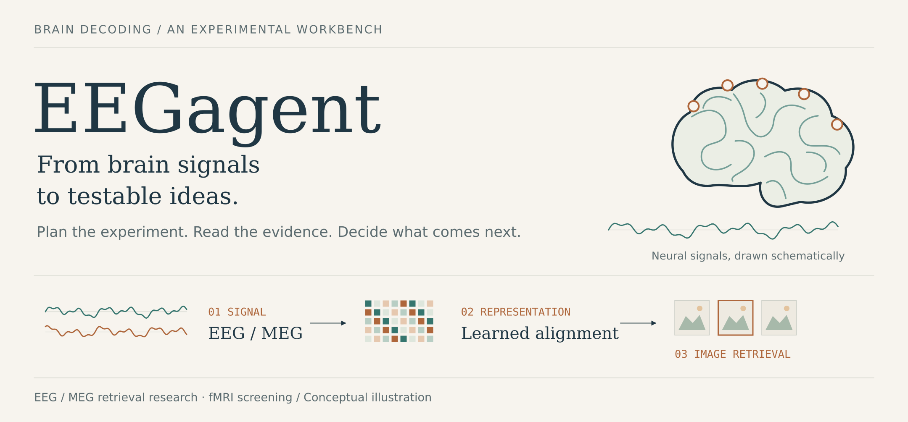

**Agent-guided research for brain decoding.**

EEGagent helps turn a decoding question into a controlled experiment: choose what to test, implement a candidate, compare it with a control, and use the result to decide what comes next. It brings EEG / MEG image-retrieval research and fMRI response screening into one local workbench.

[Start here](#start-here) · [Research loop](#the-research-loop) · [fMRI screening](#a-second-workflow-fmri-screening) · [Run a study](docs/running.md) · [Architecture](docs/architecture.md)

## Research starts with a question

A retrieval score tells you how a decoder performed. The next experiment asks why: did an encoder change help, does the comparison hold under the same protocol, and what evidence would distinguish the proposed explanation from an alternative?

EEGagent keeps that question connected to the code and the result. A campaign records the hypothesis, candidate implementation, control, diagnostics and next decision. The useful outcome can be an improved candidate, a negative result, or a clearer reason to stop.

| If you have… | Start with… | You get… |
| --- | --- | --- |
| Preprocessed EEG / MEG and image-feature caches | A retrieval design and a campaign goal | Candidate code, matched comparisons, checkpoints and research records |
| A predicted fMRI response | A screening configuration | Required checks, selected diagnostics and a scoped report |
| An image and a configured TRIBE backend | Image-to-response screening | A generated response, matched gray control and screening evidence |


The two workflows keep their protocols, state and memory separate. The workbench provides a shared place to launch runs and inspect their evidence.

## The research loop

Consider a question such as:

> Can a different EEG encoder improve image retrieval under the same evaluation protocol?

This is an illustrative research question, rather than a reported result. In a campaign, it becomes a declared intervention with a matched control and a prediction that the experiment can support or weaken.


| Research stage | What happens | What carries forward |
| --- | --- | --- |
| **Frame the question** | The planner reads the goal and current evidence. The librarian supplies local methods; the designer drafts a testable intervention. | Hypothesis, control and experiment draft |
| **Build the candidate** | The runtime validates the experiment context. The coder implements an isolated extension; the reviewer checks it and can request repair. | Checked source and a bound run specification |
| **Read the evidence** | The worker trains and evaluates. The runtime settles the result and matched comparison; the analyst interprets the tested hypothesis. | Diagnostics, assessment and a possible next action |
| **Retain what is supported** | The auditor checks draft claims against the latest result. The curator proposes conditional lessons for later use. | Scoped audit records and accepted lessons |

These stages explain the collaboration; the campaign is state-driven. It invokes roles as needed, can return to earlier questions, and can stop before a full run. All handoffs pass through the runtime and its records. The [architecture map](docs/architecture.md) connects each responsibility to source code.

### What makes this a decoding study

**The comparison has a fixed meaning.** The protocol freezes the split, validation query/gallery, image features and metric identity. Candidate changes target supported encoder, statistics, training-transform or objective hooks, while the evaluation contract stays attached to the run.

**Code is part of the experiment.** A candidate is an isolated extension with recorded source and configuration identities. Approval, implementation checks and review precede a training job; settlement checks whether its outputs belong to the expected run.

**Evidence determines the next step.** A short pilot remains pilot evidence. Stronger confirmation requires matched full runs, declared seeds and an explicit confirmation policy. Memory retains the conditions and limits of a lesson, including findings that do not support improvement.

## A second workflow: fMRI screening

Start with an existing surface series, or generate one from an image using a configured external TRIBE backend. Required checks establish the initial evidence. A rule policy or configured LLM planner selects further checks; the runtime validates and executes them, then updates the open questions.

Checks can cover numeric and temporal behavior, surface and ROI profiles, reference distributions, gray-control contrast and cross-image specificity. Optional semantic and CortexMAE checks depend on configuration and resources.

The report retains **`claim_scope=numeric_consistency_only`**, together with a verdict, screening decision and stop reason. [View the screening loop](docs/figures/03-fmri-screening-loop.png) or [run a screening study](docs/running.md#generate-from-an-image-and-screen-the-prediction).

## Start here

Use Python **3.11+** and `uv`:

```bash
git clone https://github.com/ZhipengXx/EEGagent.git
cd EEGagent/react-agent
uv sync --group dev
cp .env.example .env
```

Try the offline numeric screening example. It uses the rule policy and needs no LLM call or TRIBE generation:

```bash
uv run python -m react_agent.fmri.cli make-demo --out examples/fmri_demo

uv run python -m react_agent.fmri.cli check \
  --sample examples/fmri_demo/ok_numeric.json \
  --config configs/fmri_check.yaml \
  --backend none --policy rule \
  --out runs/rule_ok

uv run python -m react_agent.fmri.workbench
```

Open [localhost:8765](http://127.0.0.1:8765) to inspect screening runs and configure retrieval experiments. The research view exposes campaign decisions, candidate code, results and run controls.

For a real retrieval campaign, prepare the preprocessed data, image features, Torch interpreter, DeepSeek backend and a goal with explicit budgets and seeds. Then create and start it from `react-agent/`:

```bash
uv run python -m react_agent.eeg_research.agentic.cli create \
  --campaign my_retrieval_study --goal /path/to/goal.yaml --gpu 0

uv run python -m react_agent.eeg_research.agentic.cli start \
  --campaign my_retrieval_study
```

`create` freezes the protocol and writes campaign state. `start` launches the worker and can consume API and GPU budget. [The running guide](docs/running.md) covers prerequisites, goal validation, dry probes, pause/resume/stop and pack evaluation.

## Current research scope

| Area | Current scope |
| --- | --- |
| Decoding task | EEG / MEG **image retrieval** from preprocessed signals; classification, image reconstruction, raw preprocessing and foundation-model adapters are unavailable |
| Method evidence | Bundled local method cards; online literature retrieval is not implemented |
| Role models | Eight role-specific calls currently use the same DeepSeek fast profile |
| Result audit | Draft claims and the latest-result summary, with runtime freshness tracking; full artifact-level independent audit is not established |
| Demonstrated results | The [acceptance record](react-agent/docs/revision_acceptance_canonical.md) documents offline/CPU checks; it does not establish a new real-data retrieval gain |

The figures explain the implemented workflow. Their brain shapes, activity colors, signals and image tiles are conceptual illustrations, with no measured results implied.

## Explore the project

| Read / open | For |
| --- | --- |
| [Running guide](docs/running.md) | Installation, workflow commands, environment and development checks |
| [Architecture and source map](docs/architecture.md) | Role handoffs, runtime enforcement and implementation boundaries |
| [Figure sources](docs/figures/README.md) | Editable SVGs, PNG exports and the visual system |
| [Research runtime](react-agent/src/react_agent/eeg_research/agentic/) | Campaigns, prompts, jobs, evidence, memory and export |
| [Training worker](react-agent/src/react_agent/eeg_training/) | Protocol, candidate hooks, training and evaluation |
| [Screening and workbench](react-agent/src/react_agent/fmri/) | fMRI tools, generation, reports and the local interface |
| [Runtime entry points](react-agent/README.md) | CLI modules and LangGraph views |

Historical notes under `react-agent/docs/` describe their own revisions. Use the current source map when interpreting the runtime.

## Acknowledgments

The conversation entry originated from the [LangGraph ReAct template](https://github.com/langchain-ai/react-agent). Retrieval builds on the Uncertainty-aware Blur Prior workflow; generation integrates an external TRIBE checkout. Optional screening providers include CortexMAE and CLIP, with their own resources and setup requirements.
