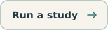
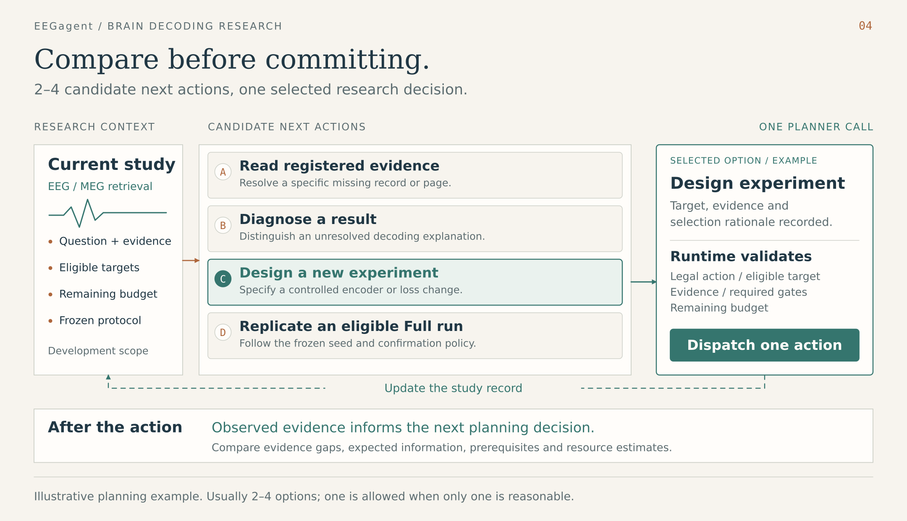

**Agent-guided research for brain decoding.**

EEGagent connects a decoding question to a controlled experiment: choose what to test, implement a candidate, compare it with a control, and use the result to decide what comes next. Its primary workflow is code-level EEG / MEG image-retrieval research. A second workflow screens predicted fMRI responses.

**Plan over alternatives.** The planner normally compares **2–4 candidate next actions in one call**, weighing the evidence gap, expected information, prerequisites and resource estimates. It records the alternatives, selects one and explains the choice; the runtime validates that selection before dispatch.

<p align="left">
  <a href="#inside-the-workbench"></a>
  <a href="#the-research-loop"></a>
  <a href="#start-here"></a>
  <a href="docs/running.md"></a>
  <a href="docs/architecture.md"></a>
</p>

## Inside the workbench

Open a study and follow the question through its decisions, candidate code and evidence. The default entry is **autonomous research at code level**. The workbench keeps the research process, experiment comparisons and recorded artifacts in separate views.


*English-localized edit of the workbench screenshot committed with `14ec3e6` on 2026-10-01. Synthetic DEMO data; not a newly captured run. The current interface has since changed.*

| View | What you can inspect in the current workbench |
| --- | --- |
| **Process** | Agent call activity, recorded decision rationale, evidence links and outcomes; select a training job to inspect loss and fixed-gallery validation curves |
| **Experiments** | Candidate and control comparisons, Pilot / Full evidence, seed coverage and whether a result is comparable |
| **Code & artifacts** | Candidate source, review summaries and recorded analysis / audit artifacts |

The curves follow each job's recorded history. A falling loss is a training diagnostic; an improvement claim needs a valid matched comparison. Role indicators follow recorded call events, with the training worker shown separately.

<details>
<summary>Recorded study summary and more platform views</summary>


*A second viewport from the same recorded DEMO revision. See the [platform gallery](docs/platform.md) for screenshot provenance, smaller-screen views and a checklist for refreshing the images.*

</details>

## Research starts with a question

A retrieval score tells you how a decoder performed. The next experiment asks why: did an encoder change help, does the comparison hold under the same protocol, and what evidence would distinguish the proposed explanation from an alternative?

EEGagent keeps that question connected to the code and the result. A campaign records the hypothesis, candidate implementation, control, diagnostics and next decision. The useful outcome can be an improved candidate, a negative result, or a clearer reason to stop.

| If you have… | Start with… | You get… |
| --- | --- | --- |
| Preprocessed EEG / MEG and image-feature caches | A retrieval design and a campaign goal | Candidate code, matched comparisons, checkpoints and research records |
| A predicted fMRI response | A screening configuration | Required checks, selected diagnostics and a scoped report |
| An image and a configured TRIBE backend | Image-to-response screening | A generated response, matched gray control and screening evidence |

The two workflows keep their protocols, state and memory separate. The workbench provides a shared place to launch runs and inspect their evidence. The [system overview](docs/figures/01-system-overview.png) maps the two study paths.

## The research loop

Consider a question such as:

> Can a different EEG encoder improve image retrieval under the same evaluation protocol?

This is an illustrative research question, rather than a reported result. In a campaign, it becomes a declared intervention with a matched control and a prediction that the experiment can support or weaken.


| Research stage | What happens | What carries forward |
| --- | --- | --- |
| **Frame the question** | The planner compares legal next actions using evidence, expected information and resource estimates. The librarian supplies local methods; the designer drafts a testable intervention. | Selected action, rationale, hypothesis and control |
| **Build the candidate** | The runtime validates the experiment context. The coder implements an isolated extension; the reviewer checks it and can request repair. | Checked source and a bound run specification |
| **Read the evidence** | The worker trains and evaluates. The runtime settles the matched comparison; the analyst interprets the hypothesis against source-bound diagnostics. | Diagnostics, assessment and a possible next action |
| **Retain what is supported** | The auditor receives a report draft and dependency manifest. Verified feedback can request a correction or narrower claim; the curator proposes conditional lessons. | Scoped audit records, unresolved issues and accepted lessons |

These stages explain the collaboration; the campaign is state-driven. It invokes roles as needed, can return to earlier questions, and can stop before a full run. All handoffs pass through the runtime and its records. The [architecture map](docs/architecture.md) connects each responsibility to source code.

### Compare before committing



A next step can read missing evidence, diagnose a result, design a new candidate experiment, or replicate an eligible Full run. Different options can pursue different interventions or resolve different uncertainties. Each carries a target, evidence references, expected information, prerequisites, outcome interpretations and a cost basis.

**One response contains the alternatives and the selection.** The saved decision includes `options`, `selected_option_id` and `selection_rationale`. The runtime checks the selected action against current targets, evidence, gates and budget, then dispatches that action. Its outcome becomes evidence for the next round.

New campaigns use `compare_options` by default. The planner prompt asks for 2–4 materially different options; a single option is allowed when only one is reasonable. The options are candidate research actions, while trained model candidates retain their own identities, source and experiment records.

### What makes this a decoding study

**The comparison has a fixed meaning.** The protocol freezes the split, validation query/gallery, image features and metric identity. Candidate changes target supported encoder, statistics, training-transform or objective hooks, while the evaluation contract stays attached to the run.

**Code is part of the experiment.** A candidate is an isolated extension with recorded source and configuration identities. Approval, implementation checks and review precede a training job; settlement checks whether its outputs belong to the expected run.

**Evidence determines the next step.** A short pilot remains pilot evidence. Stronger confirmation requires matched full runs, declared seeds and an explicit confirmation policy. Memory retains the conditions and limits of a lesson, including findings that do not support improvement.

**A decision carries its evidence.** Selected artifact pages are verified and delivered within explicit limits. Audit feedback remains tied to the report and dependency snapshot it reviewed; a repair does not by itself close an audit issue.

## A second workflow: fMRI screening

Start with an existing surface series, or generate one from an image using a configured external TRIBE backend. Required checks establish the initial evidence. A rule policy or configured LLM planner selects further checks; the runtime validates and executes them, then updates the open questions.

Checks can cover numeric and temporal behavior, surface and ROI profiles, reference distributions, gray-control contrast and cross-image specificity. Optional semantic and CortexMAE checks depend on configuration and resources.

The report retains **`claim_scope=numeric_consistency_only`**, together with a verdict, screening decision and stop reason. [View the screening loop](docs/figures/03-fmri-screening-loop.png) or [run a screening study](docs/running.md#generate-from-an-image-and-screen-the-prediction).

## Start here

Use Python **3.11+** and `uv`:

```bash
git clone https://github.com/ZhipengXx/EEGagent.git
cd EEGagent/react-agent
uv sync --group dev
cp .env.example .env
```

Open the research workbench:

```bash
uv run python -m react_agent.fmri.workbench
```

Visit [localhost:8765](http://127.0.0.1:8765) for the default research view. To explore the interface without an LLM call or training job, open the [explicit platform demo](http://127.0.0.1:8765/?demo=1#research/demo_ui_workspace). It creates synthetic records in a separate demo directory.

For an offline fMRI numeric screening example, use the rule policy:

```bash
uv run python -m react_agent.fmri.cli make-demo --out examples/fmri_demo

uv run python -m react_agent.fmri.cli check \
  --sample examples/fmri_demo/ok_numeric.json \
  --config configs/fmri_check.yaml \
  --backend none --policy rule \
  --out runs/rule_ok
```

Inspect the resulting report in the workbench's fMRI screening view.

For a real retrieval campaign, prepare the preprocessed data, image features, Torch interpreter, DeepSeek backend and a goal with explicit budgets and seeds. Then create and start it from `react-agent/`:

```bash
uv run python -m react_agent.eeg_research.agentic.cli create \
  --campaign my_retrieval_study --goal /path/to/goal.yaml --gpu 0

uv run python -m react_agent.eeg_research.agentic.cli start \
  --campaign my_retrieval_study
```

`create` freezes the protocol and writes campaign state. `start` launches the worker and can consume API and GPU budget. [The running guide](docs/running.md) covers prerequisites, goal validation, dry probes, pause/resume/stop and pack evaluation.

## Current research scope

| Area | Current scope |
| --- | --- |
| Decoding task | EEG / MEG **image retrieval** from preprocessed signals; classification, image reconstruction, raw preprocessing and foundation-model adapters are unavailable |
| Method evidence | Bundled local method cards; online literature retrieval is not implemented |
| Role models | Eight role-specific calls currently use the same DeepSeek fast profile |
| Planning and evidence reads | Default `compare_options`: usually **2–4 next-action alternatives**, one selected action and a saved rationale; bounded, verified artifact reads support selected role requests |
| Result audit | Structured report and dependency context, identity / freshness checks and tracked corrections; same-provider review does not establish independent replication |
| Demonstrated results | Platform DEMO values are synthetic. Historical acceptance records describe their own revisions and do not establish a new retrieval benchmark gain |

The brain-decoding illustrations explain the workflow; their signals and activity colors are conceptual. Platform screenshots are rendered application views with synthetic DEMO records. Neither is a measured research result.

## Explore the project

| Read / open | For |
| --- | --- |
| [Platform gallery](docs/platform.md) | Recorded interface screenshots, current view descriptions and image-refresh guidance |
| [Running guide](docs/running.md) | Installation, workflow commands, environment and development checks |
| [Architecture and source map](docs/architecture.md) | Role handoffs, runtime enforcement and implementation boundaries |
| [Figure sources](docs/figures/README.md) | Editable SVGs, PNG exports and the visual system |
| [Research runtime](react-agent/src/react_agent/eeg_research/agentic/) | Campaigns, prompts, jobs, evidence, memory and export |
| [Training worker](react-agent/src/react_agent/eeg_training/) | Protocol, candidate hooks, training and evaluation |
| [Screening and workbench](react-agent/src/react_agent/fmri/) | fMRI tools, generation, reports and the local interface |
| [Runtime entry points](react-agent/README.md) | CLI modules and LangGraph views |

Use the current source map when interpreting the runtime.

## Acknowledgments

The conversation entry originated from the [LangGraph ReAct template](https://github.com/langchain-ai/react-agent). Retrieval builds on the Uncertainty-aware Blur Prior workflow; generation integrates an external TRIBE checkout. Optional screening providers include CortexMAE and CLIP, with their own resources and setup requirements.
