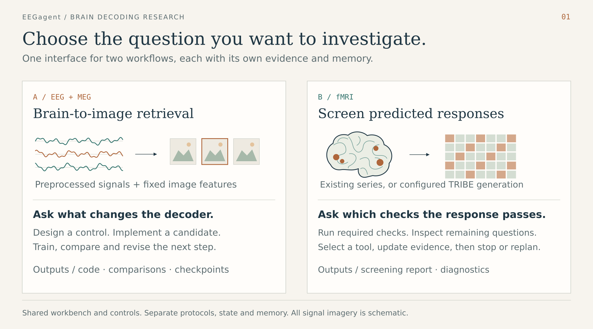
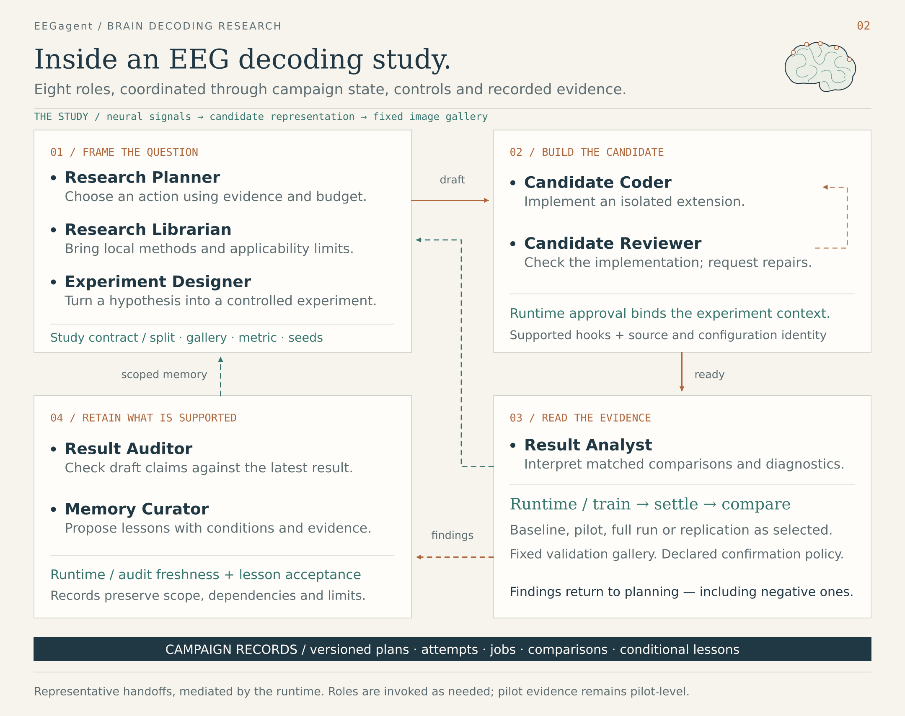
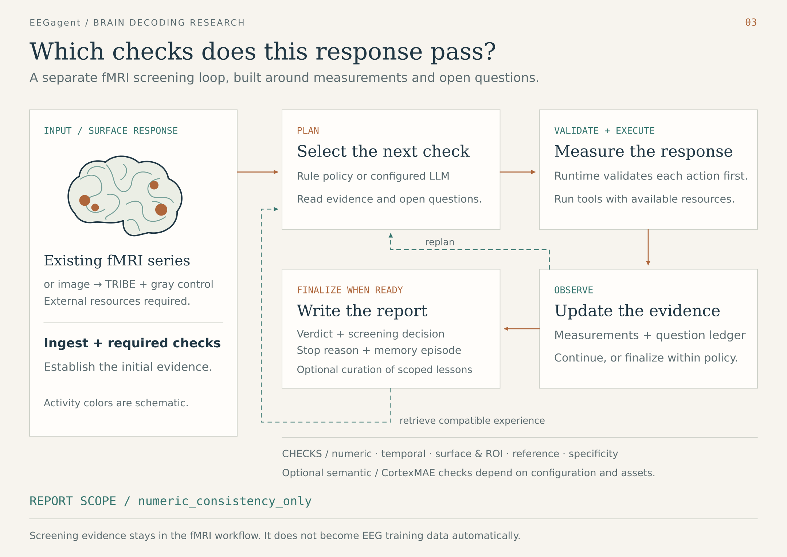

# Architecture and source map

Inspection baseline: [`09dc98f83e8e4aa944245cfeb661d87e4af2e170`](https://github.com/ZhipengXx/EEGagent/tree/09dc98f83e8e4aa944245cfeb661d87e4af2e170), committed on 2026-10-04 (UTC+08:00). This map includes next-action comparisons, verified artifact reads, bound audit feedback and execution recovery. See the [running guide](running.md) for setup and the [platform gallery](platform.md) for recorded UI images.

## Reading the figures

The visual system uses warm paper, ink blue, muted teal and copper. Dark bullet labels identify LLM roles; teal text identifies runtime responsibilities or study context. Copper arrows show representative forward handoffs; dashed arrows show conditional paths, repairs, feedback or scoped-memory retrieval. Color is paired with text labels.

Arrows represent semantic handoffs mediated by the runtime. They do not imply direct role-to-role messages, separate services, mandatory invocation order, or parallel execution. The overview separates the two studies; the EEG figure groups roles into four research stages with conditional feedback, and the fMRI figure shows the check-and-observe loop. Brain shapes, activity colors, signal traces, representation tiles and image glyphs are conceptual drawings, not anatomical maps, measured data or benchmark results.

## System overview

| Figure element | Implementation | Boundary |
| --- | --- | --- |
| Workbench and controls | [`fmri/workbench.py`](../react-agent/src/react_agent/fmri/workbench.py) and workflow CLIs | A shared interface does not merge workflow evidence or memory |
| fMRI loop | [`fmri/graph.py`](../react-agent/src/react_agent/fmri/graph.py), [`fmri/loop.py`](../react-agent/src/react_agent/fmri/loop.py) | Numeric-consistency screening |
| Image materialization | [`fmri/pipeline_graph.py`](../react-agent/src/react_agent/fmri/pipeline_graph.py), [`fmri/generation/`](../react-agent/src/react_agent/fmri/generation/) | External TRIBE resources; optional generation before screening |
| EEG campaign | [`agentic/loop.py`](../react-agent/src/react_agent/eeg_research/agentic/loop.py), [`agentic/worker.py`](../react-agent/src/react_agent/eeg_research/agentic/worker.py) | State-driven actions and service calls |
| ReAct entry | [`graph.py`](../react-agent/src/react_agent/graph.py) | Conversation graph |
| Studio adapters | [`langgraph.json`](../react-agent/langgraph.json), [`studio_graph.py`](../react-agent/src/react_agent/eeg_research/agentic/studio_graph.py) | EEG view wraps ticks as load → step → summarize |

## EEG role collaboration

The planner receives current observations. `available_actions()` derives executable choices from state and budget. New campaigns use `compare_options`: the prompt asks for 2–4 materially different action-target options in one call, and the schema permits at most four. One option is allowed when only one is reasonable. The same response records `options`, `selected_option_id` and `selection_rationale`; selected action / target / question and evidence references must match the top-level decision. `tick()` reconciles work, checks the latest gates and routes that selection through the appropriate service. Job settlement and analysis can occur without an extra planner decision; legacy campaigns can retain `single_action` mode.

The [planning illustration](figures/04-planning-options.png) depicts this comparison and selection. Its options are research actions, which can include a candidate experiment, diagnostic or evidence read. It does not prescribe a fixed number of new model candidates or training jobs.

| Responsibility | Source | Output / enforcement |
| --- | --- | --- |
| Planning | [`planner.py`](../react-agent/src/react_agent/eeg_research/agentic/planner.py), [`research_plan.py`](../react-agent/src/react_agent/eeg_research/agentic/research_plan.py) | Legal action comparisons, selected option and evidence-linked plan versions; bounded schema correction |
| Selected evidence reads | [`handoffs.py`](../react-agent/src/react_agent/eeg_research/agentic/handoffs.py), [`artifacts.py`](../react-agent/src/react_agent/eeg_research/agentic/artifacts.py) | Verified development-artifact pages, read budgets, selected role context and consumer delivery records |
| Local method retrieval | [`knowledge/__init__.py`](../react-agent/src/react_agent/eeg_research/agentic/knowledge/__init__.py), [`loop.py`](../react-agent/src/react_agent/eeg_research/agentic/loop.py) `_retrieve_methods` | Local cards and optional librarian interpretation; no online search |
| Experiment design | [`loop.py`](../react-agent/src/react_agent/eeg_research/agentic/loop.py) `_design_experiment`, [`experiment_designer.txt`](../react-agent/src/react_agent/eeg_research/agentic/prompts/experiment_designer.txt) | Draft with control, intervention, capabilities and evidence |
| Runtime approval | [`experiment_gate.py`](../react-agent/src/react_agent/eeg_research/agentic/experiment_gate.py), [`run_context.py`](../react-agent/src/react_agent/eeg_research/agentic/run_context.py) | Context-bound approval and frozen run specifications |
| Candidate implementation and review | [`native_patch.py`](../react-agent/src/react_agent/eeg_research/agentic/native_patch.py), [`worker.py`](../react-agent/src/react_agent/eeg_research/agentic/worker.py) | Controlled edits, checks, verdicts and bounded repairs |
| Training | [`jobs.py`](../react-agent/src/react_agent/eeg_research/agentic/jobs.py), [`train_entry.py`](../react-agent/src/react_agent/eeg_training/train_entry.py) | Training/evaluation artifacts and checkpoints |
| Evidence settlement | [`loop.py`](../react-agent/src/react_agent/eeg_research/agentic/loop.py) `_record_job`, [`comparison.py`](../react-agent/src/react_agent/eeg_research/agentic/comparison.py) | Result binding, diagnostics and matched comparison |
| Result analysis | [`worker.py`](../react-agent/src/react_agent/eeg_research/agentic/worker.py) `analyze`, [`measurement_context.py`](../react-agent/src/react_agent/eeg_research/agentic/measurement_context.py), [`result_analyst.txt`](../react-agent/src/react_agent/eeg_research/agentic/prompts/result_analyst.txt) | Bound hypothesis, source / run diagnostics, frozen evaluation population and measured parameter counts |
| Result audit and corrections | [`loop.py`](../react-agent/src/react_agent/eeg_research/agentic/loop.py) `_audit_result`, [`audit_context.py`](../react-agent/src/react_agent/eeg_research/agentic/audit_context.py) | Structured report / dependency context, audit identity and freshness, per-issue corrections and explicit re-audit closure |
| Research progress and recovery | [`research_progress.py`](../react-agent/src/react_agent/eeg_research/agentic/research_progress.py), [`development_feedback.py`](../react-agent/src/react_agent/eeg_research/agentic/development_feedback.py), [`loop.py`](../react-agent/src/react_agent/eeg_research/agentic/loop.py) | Source-bound comparison gaps, development feedback and recovery of persisted decision / read batches |
| Memory and evidence level | [`memory.py`](../react-agent/src/react_agent/eeg_research/agentic/memory.py), [`promotion.py`](../react-agent/src/react_agent/eeg_research/agentic/promotion.py) | Accepted conditional lessons and runtime promotion decisions |
| Pack reuse | [`export.py`](../react-agent/src/react_agent/eeg_research/agentic/export.py) | Hashes, source availability and evaluate-only reconstruction command |

All eight role prompts live in [`agentic/prompts/`](../react-agent/src/react_agent/eeg_research/agentic/prompts/). [`llm.py`](../react-agent/src/react_agent/eeg_research/agentic/llm.py) currently uses the DeepSeek fast profile for these calls; role names do not imply distinct model backbones. [`roles.py`](../react-agent/src/react_agent/eeg_research/agentic/roles.py), [`task_ledger.py`](../react-agent/src/react_agent/eeg_research/agentic/task_ledger.py), [`identity.py`](../react-agent/src/react_agent/eeg_research/agentic/identity.py) and [`artifacts.py`](../react-agent/src/react_agent/eeg_research/agentic/artifacts.py) maintain result envelopes, task/attempt identity and provenance.

The capability manifest declares hooks, but `available` is not a verification receipt: the current manifest initially marks verification as false. The approval gate checks registered availability; it does not require a non-null verification artifact for each hook. Unknown or disabled hooks can block approval. Candidate changes must respect the frozen contract and executable hooks.

The `_audit_result` service constructs a development-scoped report draft, verified analysis views and a dependency manifest containing hashes and filtered payloads from recorded run artifacts. It passes that context, exact report identities and prior audit feedback to the auditor. Reusable feedback must match the report reference, report hash, manifest hash and current dependency snapshot. Invalid, partial, legacy or stale feedback remains limited evidence. A deterministic integrity failure cannot be overridden by a model's PASS verdict.

Audit corrections are tracked as individual issues. A correction action does not itself close an issue: a later bound audit must cover its resolution with evidence or a verified claim withdrawal / narrowing. Selected artifact reads elsewhere in the loop verify registered content and page identity, preserve bounded context and record delivery to a consumer request. These controls do not establish independent replication or prove that an LLM inspected every underlying file.

A pilot need not lead to a full run. Full runs need not improve performance. Confirmation and stopping depend on evidence, budget and policy. Valid negative findings can be retained and audited.

## fMRI screening collaboration

| Responsibility | Source | Output / enforcement |
| --- | --- | --- |
| Ingest and required checks | [`graph.py`](../react-agent/src/react_agent/fmri/graph.py), [`loop.py`](../react-agent/src/react_agent/fmri/loop.py) | Mandatory-check results before optional selection |
| Planner / replanner | [`planning/service.py`](../react-agent/src/react_agent/fmri/planning/service.py) | Structured plan proposals |
| Action validation | [`planning/validator.py`](../react-agent/src/react_agent/fmri/planning/validator.py), [`policy.py`](../react-agent/src/react_agent/fmri/policy.py), [`planning/guards.py`](../react-agent/src/react_agent/fmri/planning/guards.py) | Tool, resource, budget and policy constraints |
| Tools and evidence | [`tools/registry.py`](../react-agent/src/react_agent/fmri/tools/registry.py), [`ledger.py`](../react-agent/src/react_agent/fmri/ledger.py) | Measurements and question coverage |
| Diagnostic stopping | [`diagnostic/stop_gate.py`](../react-agent/src/react_agent/fmri/diagnostic/stop_gate.py) | Diagnostic-mode stopping within its contract |
| Final report | [`reporting.py`](../react-agent/src/react_agent/fmri/reporting.py) | Verdict, screening decision, stop reason and scope |
| Memory | [`memory/service.py`](../react-agent/src/react_agent/fmri/memory/service.py), [`memory/repository.py`](../react-agent/src/react_agent/fmri/memory/repository.py) | Deterministic episode writing; optional curator proposals |

Planner and replanner are modes of one planning responsibility. Rule screening does not require an LLM. The curator runs only when enabled and applicable.

## Evidence and historical notes

The figures describe implementation paths. They do not claim every role has been validated in a new live campaign or that performance improved. [Canonical acceptance](../react-agent/docs/revision_acceptance_canonical.md) distinguishes offline/CPU checks from live-role and GPU runs not executed in that revision.

Older documents, including `eeg_research_v1_8.md` and `implementation_inventory.md`, are revision-specific. Their role inventories and limitations may differ from the inspected source. Treat those records as historical evidence, not the latest architecture specification.
