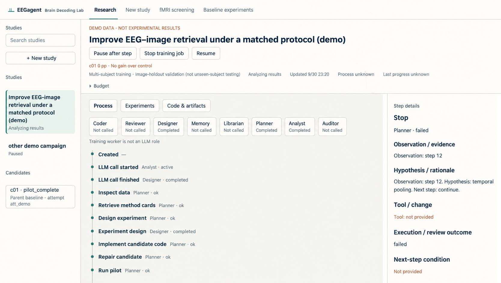
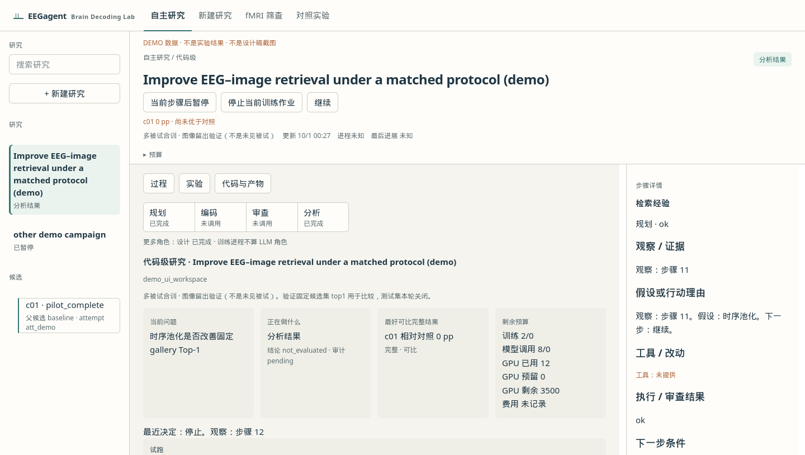
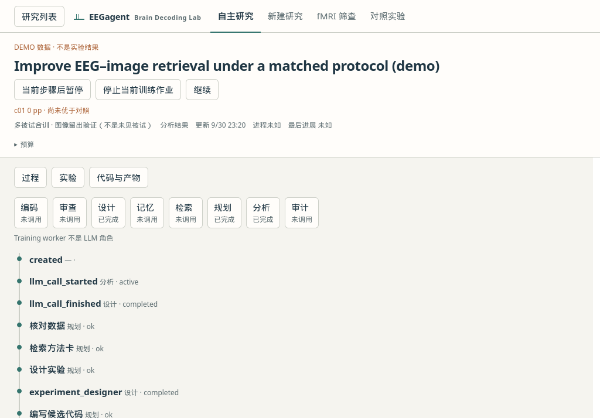
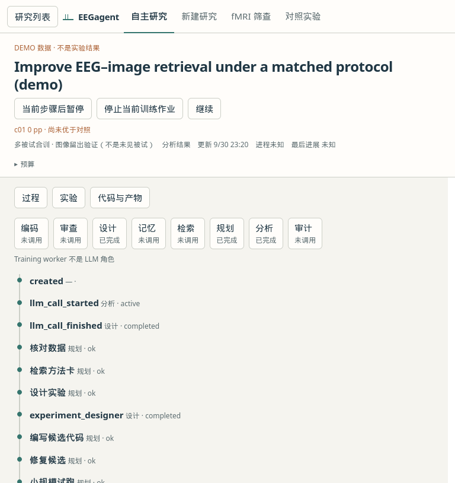

# The research workbench

EEGagent opens on autonomous code-level research. A study connects a question, candidate implementation, training job and recorded decision. The workbench makes those records inspectable through process, experiment and code / artifact views.

Current source baseline: [`09dc98f`](https://github.com/ZhipengXx/EEGagent/tree/09dc98f83e8e4aa944245cfeb661d87e4af2e170). Screenshot baseline: [`14ec3e6`](https://github.com/ZhipengXx/EEGagent/commit/14ec3e6), committed on 2026-10-01 (UTC+08:00). The original images are application captures from that revision, using synthetic DEMO data. The English process image is a text-localized edit for documentation, not an unedited browser capture. No application view was recaptured for this README update. Subsequent UI changes, including `29fbeed`, are not shown in these images.

## Recorded desktop views

### Research process



The English-localized viewport shows study navigation, eight role indicators, a process timeline and the selected step's details. [Original capture](figures/ui-workspace/ui-workspace-1440.png). Its synthetic stop / failure entry is demo content, not a measured research outcome or a current-runtime failure report.

### Study summary



This capture shows the recorded summary cards. The filename ends in `experiments`, but the viewport does not provide a complete comparison-table or training-curve view. The DEMO's `0 pp` result means no gain over its synthetic control.

## Recorded smaller-screen views

<details>
<summary>1024-pixel viewport</summary>



</details>

<details>
<summary>768-pixel viewport</summary>



</details>

## What the current interface exposes

The descriptions here follow the current source, rather than the older screenshots.

| Surface | Recorded information |
| --- | --- |
| Agent activity | Primary Planner / Coder / Reviewer / Analyst indicators; additional roles in “All roles”; current call activity and last recorded state |
| Research process | Filterable steps, history pagination, selected decision rationale, evidence used, action, outcome and links to later recorded decisions |
| Training job | Job selection, per-epoch loss, fixed-gallery validation Top-1 / Top-5, missing-data gaps and Pilot / Full scope |
| Experiments | Candidate / control comparisons, evaluation validity, fidelity and seed coverage; ranking excludes invalid or incomparable results |
| Code & artifacts | Candidate code, review summaries and inspectable linked records |
| Study controls | Pause after the current step, resume, and stop the current training job when one is active |

Decision rationale means saved decision explanations and supporting evidence. Lifecycle events can lack a rationale; the interface preserves that absence. Training-worker activity and LLM-role activity are separate records. Lower loss alone does not demonstrate better retrieval.

Source: [`workbench_static/app.js`](../react-agent/src/react_agent/fmri/workbench_static/app.js), [`timeline.py`](../react-agent/src/react_agent/eeg_research/agentic/timeline.py), [`job_metrics.py`](../react-agent/src/react_agent/eeg_research/agentic/job_metrics.py) and [`artifact_view.py`](../react-agent/src/react_agent/eeg_research/agentic/artifact_view.py). The screenshot baseline and DEMO provenance are recorded above; follow the capture procedure below when refreshing the images.

## Refreshing the platform images

Run the workbench from `react-agent/`:

```bash
uv run python -m react_agent.fmri.workbench
```

Open [the explicit demo](http://127.0.0.1:8765/?demo=1#research/demo_ui_workspace), or a recorded real study with its data provenance identified. For a new capture set:

1. Capture a desktop process view with the selected decision and agent activity visible.
2. Capture a training-job view with both loss and fixed-gallery validation charts visible. Include job identity, epoch axes and fidelity; preserve missing-value gaps.
3. Capture the experiment comparison table with candidate, control, metric, fidelity and seed scope visible.
4. Capture code / artifacts with a selected review or analysis record, then check 1024- and 768-pixel layouts.
5. Record the exact commit, capture date, viewport and DEMO / real-data provenance alongside the replacement images. Replace these historical captions only after the new images exist.

Use application screenshots for platform views and editable conceptual diagrams for collaboration. Keep demo labels visible, retain the paper / ink / teal / copper visual style, and avoid adding unrecorded activity or fabricated curves to a screenshot.

[Start a study](running.md) · [Understand the research loop](architecture.md) · [Edit the illustrations](figures/README.md)
