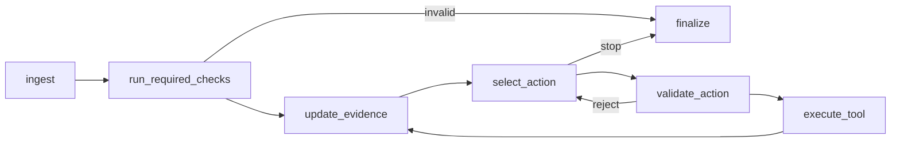

# version 1.0：当前 Agent 如何工作

这是仓库在 **version 1.0** 时的实现快照：两条 LangGraph 各自做什么、怎么跑、边界在哪。  
不是设计提案，也不替代实现规范 [`src/react_agent/version/react_agent_deepseek_fmri_cursor_prompt.md`](../../src/react_agent/version/react_agent_deepseek_fmri_cursor_prompt.md)。

仓库根目录：`/home/zxuff/data/EEGagent/react-agent`。下文路径相对该根目录。

---

## 1. 版本定位

本仓库是改过的 LangGraph ReAct 模板，**不是**上游空项目：

- 聊天图仍在 [`src/react_agent/graph.py`](../../src/react_agent/graph.py)
- 伪 fMRI 检查整包在 [`src/react_agent/fmri/`](../../src/react_agent/fmri/)
- [`langgraph.json`](../../langgraph.json) 注册两张**互不共享状态**的图：

| 图名 | 入口 | 用途 |
| --- | --- | --- |
| `agent` | `src/react_agent/graph.py:graph` | 聊天 ReAct |
| `fmri_check` | `src/react_agent/fmri/graph.py:graph` | 伪 fMRI 检查闭环 |

运行约定：

- 一律用 `uv run python -m ...`（项目要求 Python ≥ 3.11，当前 venv 是 3.12）。
- 系统 `/usr/bin/python`（3.10）会报 `No module named react_agent.fmri`，这不是业务逻辑缺失。

`claim_scope` 在报告里**永远**是 `numeric_consistency_only`（见 [`src/react_agent/fmri/schemas.py`](../../src/react_agent/fmri/schemas.py)）。  
数值检查通过，只表示当前配置下的形状 / 有限值 / 统计启发式成立，**不等于**图像条件的真实脑响应正确。

配置优先级（[`src/react_agent/fmri/config.py`](../../src/react_agent/fmri/config.py)）：

`CLI 显式覆盖 > 凭证类环境变量 > YAML > 代码默认值`

科学阈值只写在 YAML（如 [`configs/fmri_check.yaml`](../../configs/fmri_check.yaml)），环境变量不能改阈值。

---

## 2. 图 A：聊天 ReAct（附带）

入口：[`src/react_agent/graph.py`](../../src/react_agent/graph.py)，Studio 图名 `agent`。

```text
__start__ → call_model ⇄ tools → __end__
```

工作方式：

1. `call_model` 用 Context 里的聊天模型，绑上工具列表后调用。
2. 若返回 `tool_calls`，进入 `tools`（LangGraph `ToolNode`），执行后再回到 `call_model`。
3. 没有 tool call 则结束。到达步数上限仍要调工具时，返回固定失败句。

默认：

- 模型：`deepseek/deepseek-chat`（[`src/react_agent/context.py`](../../src/react_agent/context.py)；可用环境变量 `MODEL` 覆盖）
- 系统提示：通用助手（[`src/react_agent/prompts.py`](../../src/react_agent/prompts.py)）
- 唯一工具：Tavily `search`（[`src/react_agent/tools.py`](../../src/react_agent/tools.py)），需要 `TAVILY_API_KEY`

这张图**不读** fMRI 数组，**不写** `report.json`，**不共享** `fmri_check` 的工具注册表、预算或 SampleSpec。Studio 里选 `agent` 看到的是聊天循环，不是检查器。

---

## 3. 图 B：fmri_check（正文）

入口：[`src/react_agent/fmri/graph.py`](../../src/react_agent/fmri/graph.py)，节点实现都在 [`src/react_agent/fmri/loop.py`](../../src/react_agent/fmri/loop.py)。  
CLI（`python -m react_agent.fmri.cli`）走同一套 `run_sample`，不依赖 Studio。



### 3.1 各节点做什么

| 节点 | 作用 |
| --- | --- |
| `ingest` | 解析 `SampleSpec`，对磁盘上的 `.npy` 建只读引用与 fingerprint，**不把大数组放进 LM / state** |
| `run_required_checks` | 按配置顺序跑必做检查；`validate_input` 畸形则直接 finalize |
| `update_evidence` | 汇总 findings、启发式 `need_score`、不可用检查、无进展计数 |
| `select_action` | rule 或 hybrid 选出下一步：`run_tool` 或 `stop` |
| `validate_action` | 拒绝非法动作（不在候选、重复、非法 args、无效 evidence_ref） |
| `execute_tool` | 执行**一个**工具；命中 cache 则复用 |
| `finalize` | 写 `report.json` / `report.md`，追加 `events.jsonl` |

`LoopRuntime`（工具注册表、预算、LM backend）不放进 LangGraph state；CLI / Studio 需 `bind_runtime`。

### 3.2 必做与可选工具

注册表：[`src/react_agent/fmri/tools/registry.py`](../../src/react_agent/fmri/tools/registry.py)。

| 工具 | 状态 | 何时会跑 |
| --- | --- | --- |
| `validate_input` | 真实 | 必做：二维有限数组、`time_axis`、形状契约 |
| `basic_statistics` | 真实 | 必做：均值/方差/分位数/近常数空间比例/廉价时序比 |
| `temporal_diagnostics` | 真实 | 可选：出现 `low_temporal_change` / `temporal_spike` / `degenerate_signal` |
| `roi_summary` | 真实 | 可选：样本提供 `roi_map_path` 且长度对齐 V |
| `reference_distribution` | 真实 | 可选：磁盘上有兼容的冻结参考统计 |
| `cortex_mae` | 占位 disabled | 不跑 |
| `semantic_consistency` | 占位 disabled | 不跑 |

`max_tool_calls` **计入**必做检查。缺 ROI 时 `roi_summary` 记为 unavailable（`no_roi_map`），不是编造脑区。

规则策略优先级（[`src/react_agent/fmri/policy.py`](../../src/react_agent/fmri/policy.py) `rule_decision`）：

1. 输入畸形 → `stop / invalid_input`
2. 未完成的必做检查
3. 有时序 flag 且 `temporal_diagnostics` 可跑
4. 有 ROI map → `roi_summary`
5. 有兼容参考 → `reference_distribution`
6. 仍有 flag 但无候选 → `stop / flagged_findings`
7. 否则 → `stop / configured_checks_complete`

已完成、已 skip、已失败的工具不会再被选中。

### 3.3 策略与 backend

| `--policy` | `--backend` | 行为 |
| --- | --- | --- |
| `rule` | 强制 `none` | 全离线，不调 API |
| `hybrid` | `mock` | 按脚本/默认脚本选下一步（演示用） |
| `hybrid` | `deepseek` | DeepSeek JSON Action；缺 `DEEPSEEK_API_KEY` 直接退出 |

Hybrid 时模型只能在**已过滤候选**里选 `run_tool` 或 `stop`。非法动作被 `validate_decision` 打回；预算耗尽或解析失败可回退到 rule（`fallback_used=true`）。  
DeepSeek 走 OpenAI 兼容接口（默认 `https://api.deepseek.com`），应用层指定 `deepseek-chat`（需要 tool-calling；不要用 `deepseek-reasoner`）。服务端可能回 `deepseek-flash`，报告里会记下 requested / response model。

Observation 只含摘要指标与路径引用，**不序列化** `[T, V]` 数组。

### 3.4 Verdict

[`src/react_agent/fmri/reporting.py`](../../src/react_agent/fmri/reporting.py) 确定性判定，优先级：

`invalid_input` > `flagged` > `inconclusive` > `passed_configured_checks`

- `invalid_input`：契约失败或硬错误（含 `malformed`）
- `flagged`：必做可完成，但存在 `flag` / `error` finding（例如相对参考的 `reference_deviation`）
- `inconclusive`：必做未完成，或问题未解决且对应工具不可用
- `passed_configured_checks`：当前配置下的检查做完且无 flag

`need_score` 是工程启发式（A/M/D），**不是**风险概率或医学判断；V1 中 `w_d=0`。

### 3.5 产物

单样本目录：`runs/<out>/<safe_sample_id>/`

- `report.json`：机器可读（verdict、findings、`metrics_table`、limitations、cost）
- `report.md`：给人看的摘要

Batch 级（`--out` 根下）：

- `events.jsonl`：工具 / 决策 / stop 事件（多条样本追加到同一文件）
- `summary.csv`：每样本一行 verdict 与费用字段

`schema_version`：`fmri_check.v1`。

---

## 4. 输入契约与 TRIBE

### 4.1 SampleSpec

[`src/react_agent/fmri/schemas.py`](../../src/react_agent/fmri/schemas.py) 的输入契约。关键字段：

- `fmri_path`：磁盘上的预测数组（不复制进仓库）
- `time_axis`：必须是 `0` 或 `1`，**不猜轴**
- `expected_shape` / `expected_n_vertices`：显式契约
- `spatial_representation` / `space_name` / `normalization` / `generation_profile_id`：与参考集兼容字段
- `stimulus_events` / `output_time_origin` / `alignment_description`：只记录，不据此硬判“刺激后必须 5 秒峰值”
- `provenance.generator`：生成器身份

TRIBE `static_1s_7s` 约定：`[12, 20484]`、`time_axis=0`、`sampling_interval_s=1.0`、`fsaverage5`、`none_raw_signed`。

### 4.2 TRIBE 适配

[`src/react_agent/fmri/tribe_adapter.py`](../../src/react_agent/fmri/tribe_adapter.py) + CLI `from-tribe`：

- 读 `preds/<id>.json` sidecar，`fmri_path` 指向原 `preds/<id>.npy`
- `generation_profile_id=static_1s_7s_tribev2`
- `alignment_description` 原样抄 sidecar `mapping`：`preds[k]` 对齐 `t_video[k]`；训练 offset=5s **不再二次平移**
- 拒绝派生切片：`*_stim_plus5`、`*_stim_4to6_mean`、`*_minus_gray`

不改 TRIBE 仓库，不重跑推理。

### 4.3 已跑过的 8 条 smoke

清单：[`examples/tribe_1s7s_smoke/samples.jsonl`](../../examples/tribe_1s7s_smoke/samples.jsonl)

`apple_01b`、`apple_02s`、`gray_control`、两条 aardvark、`abacus_04s`、`calzone_07s`、`accordion_01b`。

独立配置：[`configs/fmri_check_tribe_1s7s.yaml`](../../configs/fmri_check_tribe_1s7s.yaml)（参考集是本目录 3 条拟合的 `reference_stats.json`，**不和**合成 demo 参考混用）。

该次 rule batch 的核对结果（`runs/tribe_1s7s_smoke`）：

- 8 份报告均为 `shape=[12, 20484]`、`finite_ratio=1.0`、`claim_scope=numeric_consistency_only`
- 无 ROI → `roi_summary:no_roi_map`
- 5 条 `passed_configured_checks`；`apple_02s` / `abacus` / `calzone` 因相对 3 条冻结参考的 `reference_deviation` 被 `flagged`
- 参考集内样本因 fingerprint 重叠跳过 `reference_distribution`

这只说明数值契约与相对参考启发式，**不声称**真实脑响应正确。

---

## 5. 怎么跑

工作目录必须是仓库根。

### 5.1 合成 demo

```bash
uv sync --group dev
uv run python -m react_agent.fmri.cli make-demo --out examples/fmri_demo
uv run python -m react_agent.fmri.cli fit-reference \
  --manifest examples/fmri_demo/reference.jsonl \
  --out examples/fmri_demo/reference_stats.json \
  --config configs/fmri_check.yaml
uv run python -m react_agent.fmri.cli batch \
  --manifest examples/fmri_demo/samples.jsonl \
  --config configs/fmri_check.yaml \
  --backend mock --policy hybrid \
  --out runs/demo
```

单条 rule（无 API）：

```bash
uv run python -m react_agent.fmri.cli check \
  --sample examples/fmri_demo/ok_numeric.json \
  --config configs/fmri_check.yaml \
  --backend none --policy rule \
  --out runs/rule_ok
```

### 5.2 TRIBE sidecar → JSONL

```bash
uv run python -m react_agent.fmri.cli from-tribe \
  --preds-dir /home/zxuff/data/tribev2/exp/things_static_1s_7s/preds \
  --ids apple_01b gray_control \
  --out examples/tribe_1s7s_smoke/samples.jsonl
```

### 5.3 TRIBE 8 条 rule smoke

```bash
uv run python -m react_agent.fmri.cli batch \
  --manifest examples/tribe_1s7s_smoke/samples.jsonl \
  --config configs/fmri_check_tribe_1s7s.yaml \
  --backend none --policy rule \
  --out runs/tribe_1s7s_smoke
```

### 5.4 环境变量（只放凭证）

见 [`.env.example`](../../.env.example)：

- 聊天图：`DEEPSEEK_API_KEY`（或其它 provider）、`TAVILY_API_KEY`
- 检查图 hybrid：`DEEPSEEK_API_KEY`、`DEEPSEEK_BASE_URL`、`DEEPSEEK_FAST_MODEL` / `DEEPSEEK_REASONING_MODEL`

`hybrid` + `deepseek` 且没有 key：CLI **立刻失败**，不会静默改成 rule。

Studio：`uv run langgraph dev`，在 UI 里选图名 `agent` 或 `fmri_check`。`fmri_check` 仍需绑定 runtime（日常检查用 CLI 更直接）。

---

## 6. 明确不做

当前 version 1.0 **不会**：

- 训练或微调任何模型
- 重跑 TRIBE / 下载权重
- 自动“修好”预测数组
- 把 `[T, V]` 大数组塞进 LM prompt
- 把 sidecar 的 5s 训练 offset 再平移一次
- 把“刺激后必须出现 5 秒峰值”写成硬规则
- 声称 `cortex_mae` 或 `semantic_consistency` 已实现
- 声称 `passed_configured_checks` = 真实 fMRI / 图像语义正确
- 一次把约 1 万条 TRIBE sidecar 送进检查器（只做过 8 条 smoke）

扩工具：在 `src/react_agent/fmri/tools/` 实现、在 `build_registry()` 注册、在 YAML `enabled_tools` 打开；**不要**改 `graph.py` 拓扑。
